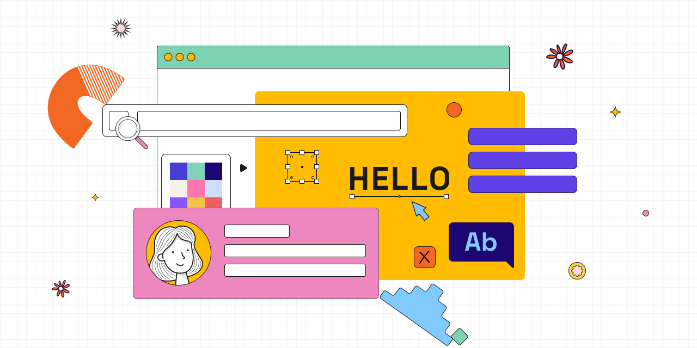

# Personal Website of Hanna Stelmakh
This repository contains the source code of my personal portfolio website, showcasing my work as a UI/UX Designer.
You are welcome to browse and explore the implementation.

Please refer to the [LICENSE](LICENSE) file for details on usage and restrictions.

## Setup
To spin up the environment for local development, [Docker](https://www.docker.com/) is recommended but not required.
Next steps assume that you have Docker installed and running. If you want to start the environment without Docker, 
consider inspecting [Makefile](Makefile) for the examples of commands to be executed to set up the environment.

Follow the next steps to get started:
1. Clone the Git repository.
2. Run `make setup` to build PHP image and install dependencies.
3. Run `make stasis-generate-dev` to generate the static website in dev mode (linking assets from Vite dev server).
4. Run `make vite-dev` to start Vite in watch mode with assets server.
5. Run `make stasis-server` to start Stasis development server which serves the generated static website.
6. Open [http://localhost:8000](http://localhost:8000) in your browser to view the website.

> [!IMPORTANT]
> Once the template or route are changed, for the changes to take an effect, site should be re-generated by running 
> `make stasis-generate-dev` command. Assets are re-built and hot reloaded in browser automatically due to watch mode 
> in Vite with HMR (hot module replacement).
